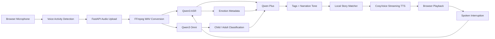

# The Listening Storyteller

> An emotion-aware, voice-first AI storyteller that listens, understands, and narrates.

**The Listening Storyteller** is the English portfolio title of **识语绘声**, whose product interface and voice interaction remain Chinese-first.

The Listening Storyteller is an interactive storytelling application designed for children and families. A user simply speaks about the kind of story they want to hear. The system recognizes the request and emotional context, identifies whether the speaker is a child or an adult, matches a story from a curated local library, selects an appropriate narration style, and streams the generated speech back to the browser.

The experience is fully voice-driven and supports spoken interruption while a story is playing, including changing the story, stopping playback, or making a new request.

## Why The Listening Storyteller

Most story applications begin with buttons, search boxes, or fixed categories. The Listening Storyteller explores a different interaction model: the story experience begins with natural speech and adapts to both meaning and emotion.

This project demonstrates an end-to-end multimodal AI pipeline rather than a single model call:

- browser-side voice activity detection and recording;
- speech recognition with emotion metadata;
- child/adult speaker classification;
- LLM-based story-tag and narration-tone selection;
- local semantic story matching across 103 stories;
- low-latency streaming text-to-speech;
- voice interruption and intent classification during playback.

## System Architecture



## Interaction Flow

1. The browser requests microphone permission after an explicit user action.
2. A lightweight volume-based detector starts recording when speech is detected.
3. FastAPI validates the upload, enforces a size limit, and converts it to 16 kHz mono WAV.
4. Qwen3-ASR-Flash produces transcription and emotion information.
5. Qwen3-Omni-Flash classifies the speaker as a child or an adult.
6. Qwen-Plus selects story tags and a narration tone from validated allowlists.
7. The backend chooses the best matching entry from the local story library.
8. CosyVoice-v3-Flash streams MP3 audio to the browser as it is generated.
9. During playback, the microphone can capture commands such as “change the story” or “stop”.

## Key Engineering Features

- **Voice-first UX** — no text input is required for the primary workflow.
- **Streaming responses** — Server-Sent Events report processing progress while TTS audio is streamed separately.
- **Defensive model parsing** — JSON fences, invalid tags, unknown tones, missing fields, and malformed intent results are handled safely.
- **Concurrency-safe classification** — speaker results are accumulated locally instead of being stored in shared global state.
- **Recording session isolation** — cancelled recordings and short noise bursts cannot create ghost requests.
- **Lifecycle management** — temporary audio and expired in-memory tasks are removed automatically.
- **Playback recovery** — a visible fallback control appears when browser autoplay is blocked.
- **Security-conscious defaults** — secrets, local environments, recordings, generated media, logs, and caches are excluded from Git.
- **Automated verification** — unit and route tests run in GitHub Actions without calling paid model APIs.

## Technology Stack

| Layer | Technology |
| --- | --- |
| Frontend | HTML, CSS, JavaScript, MediaRecorder API, Web Audio API, EventSource |
| Backend | Python, FastAPI, Uvicorn |
| Audio processing | FFmpeg, Pydub |
| Speech recognition | Qwen3-ASR-Flash |
| Multimodal classification | Qwen3-Omni-Flash |
| Semantic and intent analysis | Qwen-Plus |
| Speech synthesis | CosyVoice-v3-Flash |
| Testing and CI | Pytest, FastAPI TestClient, GitHub Actions |

## Project Structure

```text
.
├── app.py                     # API routes, uploads, SSE, and task lifecycle
├── core.py                    # Model integration, validation, matching, and TTS
├── main.py                    # Local application entry point
├── story.json                 # Tagged local story library
├── static/
│   ├── index.html             # Single-page voice interface
│   ├── script.js              # Recording, state machine, playback, and interruption
│   └── style.css              # Robot interface and responsive styling
├── tests/
│   ├── test_app.py            # FastAPI route and security behavior tests
│   └── test_core.py           # Parsing, normalization, and matching tests
├── .github/workflows/tests.yml
├── requirements.txt
└── requirements-dev.txt
```

## Getting Started

### Prerequisites

- Python 3.10 or later
- FFmpeg available on `PATH`
- An Alibaba Cloud Model Studio API key with access to the configured models
- A modern browser with MediaRecorder and Web Audio API support

Check FFmpeg before starting:

```bash
ffmpeg -version
```

### Installation

```bash
git clone https://github.com/YOUR_USERNAME/ListeningStoryteller.git
cd ListeningStoryteller
python -m venv .venv
```

Windows PowerShell:

```powershell
.\.venv\Scripts\Activate.ps1
pip install -r requirements.txt
Copy-Item .env.example .env
```

Edit `.env` and provide your own key:

```dotenv
DASHSCOPE_API_KEY=your_dashscope_api_key
```

Start the application:

```powershell
python main.py
```

Open <http://localhost:9000> and allow microphone access when prompted.

## Health Check

The following endpoint checks local runtime readiness without exposing the API key or calling an external model:

```text
GET /api/health
```

Example response:

```json
{
  "status": "ready",
  "ffmpeg": true,
  "api_key_configured": true
}
```

## API Overview

| Endpoint | Purpose |
| --- | --- |
| `POST /api/upload` | Validate, limit, and convert a browser recording |
| `GET /api/process/{task_id}` | Stream recognition and matching progress over SSE |
| `GET /api/stream-audio/{task_id}` | Stream generated MP3 narration |
| `POST /api/intent` | Classify a spoken interruption during playback |
| `GET /api/health` | Report local dependency readiness |

## Testing

```powershell
pip install -r requirements-dev.txt
pytest
python -m py_compile app.py core.py main.py
```

The automated test suite uses no live model calls and consumes no API credits. A full microphone-to-playback test requires FFmpeg and a valid API key.

## Security and Privacy

- API keys are read from environment variables and are never embedded in frontend code.
- `.env` is excluded by `.gitignore`; only `.env.example` is committed.
- Uploaded and generated audio files are excluded from version control.
- Uploads are size-limited and processed in chunks rather than loaded into memory at once.
- Temporary tasks and audio files expire and are cleaned automatically.
- The health endpoint reports only whether a key exists, never its value.

Voice data is sent to a third-party model provider during normal use. A public production deployment should add authentication, rate limiting, a privacy notice, content-safety controls, and explicit guardian consent for child users.

## Current Scope and Roadmap

The current implementation is optimized for a local or single-instance portfolio demonstration. Potential next steps include:

- Redis-backed task state for multi-instance deployment;
- configurable story-library management;
- semantic embedding retrieval instead of tag overlap alone;
- stronger echo-aware interruption detection;
- request authentication and per-user rate limits;
- end-to-end browser tests with synthetic microphone input;
- multilingual stories and narration.

## Resume Summary

> Built The Listening Storyteller, an emotion-aware voice storytelling application using FastAPI, Qwen multimodal models, and CosyVoice streaming TTS. Designed a browser audio state machine with voice activity detection and spoken interruption, implemented validated LLM output handling and story matching across 103 local stories, and added secure temporary-file lifecycle management, automated tests, and GitHub Actions CI.

## Responsible Use

The Listening Storyteller is an independent portfolio project and prototype. It should not be offered as an unsupervised public service for children without additional privacy, safety, moderation, and operational controls.
